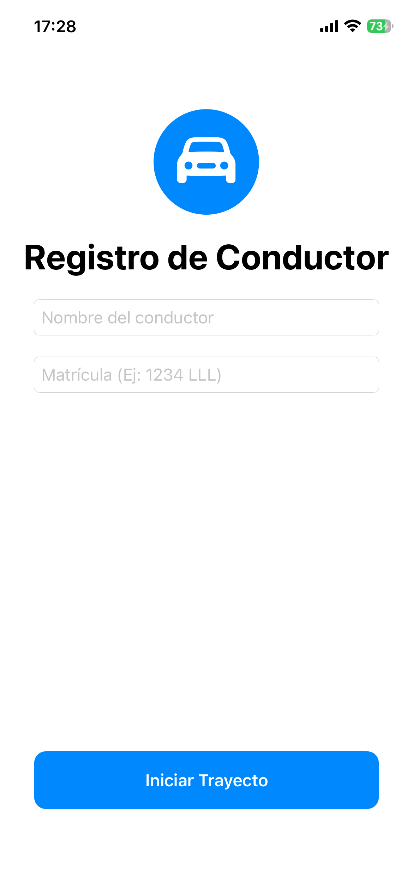
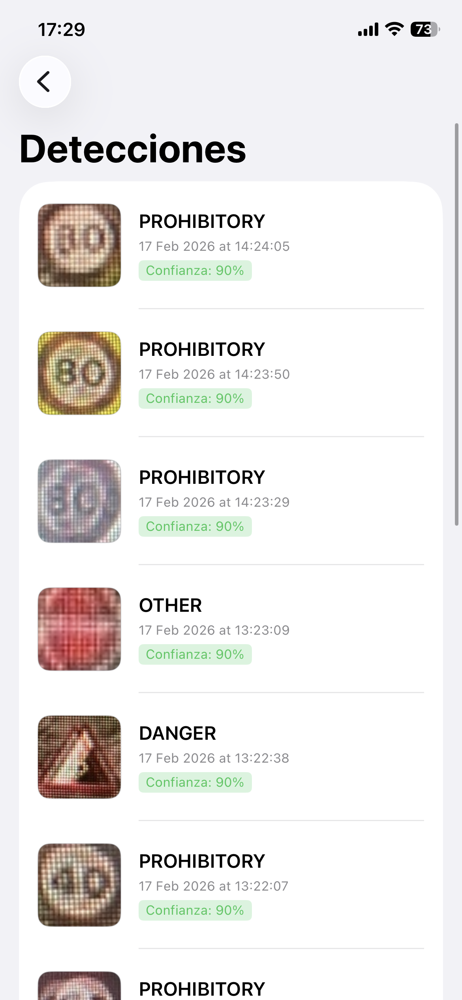

<div align="center">

# Velo

**Detección de señales de tráfico en tiempo real para iOS**

Aplicación nativa de iOS que detecta señales de tráfico en tiempo real durante
la conducción utilizando la cámara del dispositivo, un modelo YOLO11 Nano
ejecutado con CoreML y alertas por voz en español.

Trabajo de Fin de Grado · Grado en Ingeniería del Software · Universidad Rey Juan Carlos

</div>

---

## 📑 Tabla de contenidos

- [Descripción](#-descripción)
- [Características](#-características)
- [Capturas de pantalla](#-capturas-de-pantalla)
- [Arquitectura](#-arquitectura)
- [Tecnologías](#-tecnologías)
- [Requisitos](#-requisitos)
- [Instalación y ejecución](#-instalación-y-ejecución)
- [Estructura del proyecto](#-estructura-del-proyecto)
- [El modelo de detección](#-el-modelo-de-detección)
- [Autor](#-autor)
- [Licencia](#-licencia)

---

## 📖 Descripción

**Velo** es una aplicación iOS que asiste al conductor detectando señales de
tráfico en tiempo real a través de la cámara trasera del dispositivo. Cuando se
detecta una señal con suficiente confianza, la aplicación la resalta en pantalla,
emite una alerta por voz y la almacena en un historial asociado al vehículo.

Todo el procesamiento se realiza **localmente en el dispositivo**, sin necesidad
de conexión a internet, aprovechando el *Neural Engine* de los chips de Apple.

## ✨ Características

- 🎥 **Detección en tiempo real** sobre el vídeo de la cámara (~20-25 FPS).
- 🧠 **Modelo YOLO11 Nano** ejecutado con CoreML y Vision, totalmente *on-device*.
- 🔊 **Alertas por voz en español** mediante síntesis de voz (AVSpeech).
- 🗂️ **Historial de detecciones** persistente por vehículo con SwiftData.
- 📦 **Funciona sin conexión** a internet.
- 🏷️ Detección de cuatro categorías de señales: prohibición, peligro, obligación y otras.

## 📸 Capturas de pantalla

> Las capturas y el vídeo de demostración se encuentran en la carpeta [`assets/`](assets/).

| Inicio de sesión | Pantalla principal | Detección en vivo | Historial |
|:---:|:---:|:---:|:---:|
|  |  |  |  |

## 🏗️ Arquitectura

La aplicación sigue el patrón **MVVM** (Model-View-ViewModel) con dos capas de
apoyo (Repository y Service) y una capa de protocolos que desacopla los
componentes mediante **inyección de dependencias**.

```
View  ──▶  ViewModel  ──▶  Protocol  ◀──  Service / Repository  ──▶  Model
```

- **View** (SwiftUI): las pantallas. Solo muestran datos y recogen interacción.
- **ViewModel**: la lógica de presentación.
- **Protocol**: los contratos que permiten intercambiar implementaciones.
- **Service / Repository**: cámara, voz, sesión y acceso a datos.
- **Model**: las entidades de datos (SwiftData y estructuras transitorias).

## 🛠️ Tecnologías

- **Lenguaje:** Swift 5.0
- **Interfaz:** SwiftUI
- **Persistencia:** SwiftData
- **Visión y ML:** Vision + CoreML
- **Cámara y audio:** AVFoundation
- **Reactividad:** Combine
- **Modelo:** YOLO11 Nano (entrenado con Ultralytics, convertido a CoreML)

## 📋 Requisitos

- macOS con **Xcode 26** o superior
- Un **iPhone físico con iOS 26.2** o superior (la detección requiere cámara real)
- Cuenta de desarrollador de Apple para firmar y ejecutar en dispositivo

## 🚀 Instalación y ejecución

1. Clona el repositorio:
   ```bash
   git clone https://github.com/juanramirezbl/velo.git
   ```
2. Abre el proyecto en Xcode:
   ```bash
   cd velo
   open velo.xcodeproj
   ```
3. Selecciona tu equipo de firma en *Signing & Capabilities*.
4. Conecta tu iPhone, selecciónalo como destino y pulsa **Run** (⌘R).
5. Concede el permiso de cámara cuando la aplicación lo solicite.

## 📁 Estructura del proyecto

```
velo/
├── App/            # Punto de entrada e inyección de dependencias
├── Model/          # Entidades de datos (User, Detection, ...)
├── View/           # Pantallas SwiftUI
├── ViewModel/      # Lógica de presentación
├── Protocol/       # Contratos (interfaces)
├── Repository/     # Acceso a datos (SwiftData)
├── Service/        # Cámara, voz y sesión
├── Helpers/        # Utilidades de interfaz
├── Extensions/     # Extensiones de tipos del sistema
├── Core/           # Modelo CoreML (best1.mlpackage)
└── Resources/      # Assets e iconos
```

## 🧠 El modelo de detección

El modelo se entrenó mediante *transfer learning* a partir de `yolo11n.pt`
sobre un conjunto de imágenes de señales de tráfico, y posteriormente se
convirtió al formato CoreML (`best1.mlpackage`) con NMS integrado. La inferencia
se ejecuta sobre cada fotograma con un umbral de confianza del 90 % y un
*cooldown* de 5 segundos por clase para evitar alertas repetidas.

## 👤 Autor

**Juan Ramírez Blanco**
Trabajo de Fin de Grado — Grado en Ingeniería del Software
Universidad Rey Juan Carlos · Curso 2025–2026
Tutor: José Francisco Vélez Serrano

## 📄 Licencia

Este proyecto está publicado bajo la licencia **GNU LGPL v3**.
Consulta el archivo [LICENSE](LICENSE) para más detalles.
